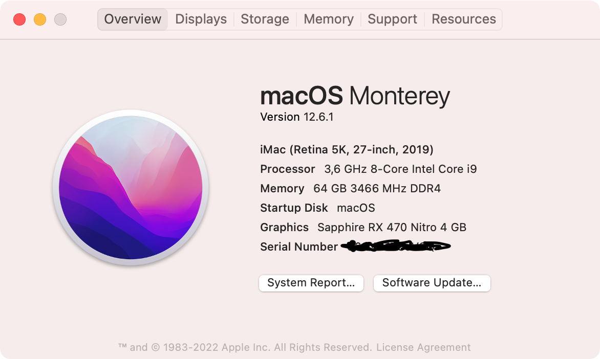
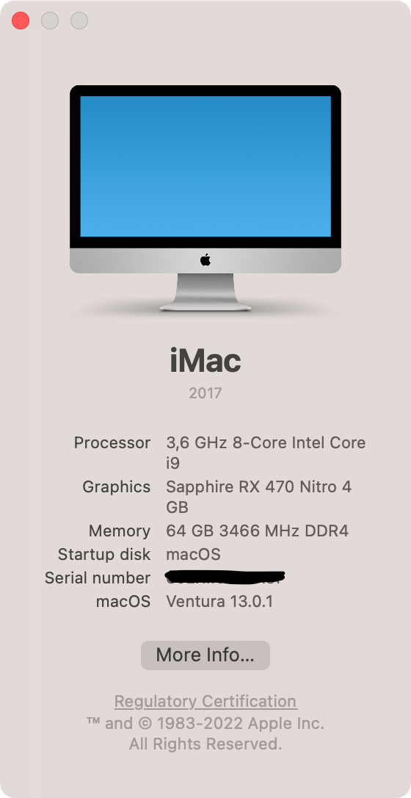

# Z390-I9-9900K-Hackintosh-OpenCore

This EFI folder copy of my working OpenCore Hackintosh build.

It took my one week and it was very fun and challenging to get it working, finding fix by searching log stuck and more

**I do not provide any warranty nor support, use at your own risk**

|  |  |
| - | - |

## My BIOS settings

**DO NOT JUST COPY MY SETTINGS, IT MAY HURT YOUR PERFORMANCE OR CPU**

<https://github.com/dalisoft/guides/blob/master/computers/z390-i9-9900k-hackintosh.md>

## My build parts

| Name         | Model                            |
| ------------ | -------------------------------- |
| Motherboard  | Gigabyte Aorus Z390 Pro Wi-Fi    |
| CPU          | Intel Core i9-9900K              |
| CPU Cooler   | CM MasterLiquid 240ML            |
| GPU          | Sapphire Nitro RX 470 4GB        |
| Memory       | Crucial Ballistic 16GB 3000CL15  |
| SSD macOS    | Samsung 970 EVO 500GB            |
| SSD Work     | Samsung 970 EVO+ 500GB           |
| HDD          | Seagate 12TB (8+4)               |
| PSU          | CM 1200W Platinum                |
| Case         | Gamdias Athena M2 Elite          |
| KB+Mouse     | Logitech K470 (if wants VM)      |
| KB+Mouse     | 🍏 Magic Keyboard 2 + Trackpad 2 |
| Web-camera   | Logitech C920 FullHD             |
| Connectivity | Fenvi T919 1300Mbps              |
| Headset      | Edifier G4                       |
| Monitor 1    | Samsung U28E590D                 |
| Monitor 2    | LG 27UK850-W                     |

## Benchmark

| Name       | Link                                               |
| ---------- | -------------------------------------------------- |
| CPU        | <https://browser.geekbench.com/v5/cpu/18212261>    |
| CPU Win11  | <https://browser.geekbench.com/v5/cpu/18455893>    |
| dGPU Metal | <https://browser.geekbench.com/v5/compute/5757443> |
| iGPU Metal | <https://browser.geekbench.com/v5/compute/5757512> |

## Current issues

| Problem                                          | Refer Link                                                                                                                                                    | Fix        |
| ------------------------------------------------ | ------------------------------------------------------------------------------------------------------------------------------------------------------------- | ---------- |
| Entering to sleep takes 20-40 seconds            | [#3](https://github.com/dalisoft/Z390-I9-9900K-Hackintosh-OpenCore/issues/3)                                                                                  | No fix yet |
| Wake from sleep does not work                    | [#2](https://github.com/dalisoft/Z390-I9-9900K-Hackintosh-OpenCore/issues/2) and [#6](https://github.com/dalisoft/Z390-I9-9900K-Hackintosh-OpenCore/issues/6) | No fix yet |
| BT devices not reacting after wake               | [#10](https://github.com/dalisoft/Z390-I9-9900K-Hackintosh-OpenCore/issues/10)                                                                                | No fix yet |
| USB Power Management                             | [#12](https://github.com/dalisoft/Z390-I9-9900K-Hackintosh-OpenCore/issues/12)                                                                                | No fix yet |
| Fans / VirtualSMC                                | [#13](https://github.com/dalisoft/Z390-I9-9900K-Hackintosh-OpenCore/issues/13)                                                                                | No fix yet |

## Status

| Features                | Status      | Issues                                                                                                                                                                                      |
| ----------------------- | ----------- | ------------------------------------------------------------------------------------------------------------------------------------------------------------------------------------------- |
| Ethernet                | Working     | -                                                                                                                                                                                           |
| Wi-Fi                   | Working     | -                                                                                                                                                                                           |
| Bluetooth               | Working     | See [#1](https://github.com/dalisoft/Z390-I9-9900K-Hackintosh-OpenCore/issues/1)                                                                                                            |
| iGPU                    | Working     | -                                                                                                                                                                                           |
| dGPU + HW acceleration  | Working     | -                                                                                                                                                                                           |
| On-board audio          | Working     | -                                                                                                                                                                                           |
| App Store               | Working     | -                                                                                                                                                                                           |
| iCloud                  | Working     | -                                                                                                                                                                                           |
| Shutdown / Restart      | Working     | -                                                                                                                                                                                           |
| USB                     | Working     | See [#12](https://github.com/dalisoft/Z390-I9-9900K-Hackintosh-OpenCore/issues/12)                                                                                                          |
| Handoff                 | Working     | -                                                                                                                                                                                           |
| Airdrop, AirPlay        | Working     | -                                                                                                                                                                                           |
| Continuity              | Working     | -                                                                                                                                                                                           |
| Apple TV+               | Working     | works reliable on macOS Ventura                                                                                                                                                             |
| Dual monitor boot       | Working     | See [#7](https://github.com/dalisoft/Z390-I9-9900K-Hackintosh-OpenCore/issues/7)                                                                                                            |
| All DP/HDMI ports       | Working     | AMD GPU ports only                                                                                                                                                                          |
| File Vault              | Not tested  | -                                                                                                                                                                                           |
| HDMI audio              | Not tested  | -                                                                                                                                                                                           |
| Apple Music / iTunes    | Not tested  | -                                                                                                                                                                                           |
| iMessage                | Not working | It does not work on my Macs                                                                                                                                                                 |
| FaceTime                | Not working | Same as iMessage                                                                                                                                                                            |
| DRM                     | Not working | See [#11](https://github.com/dalisoft/Z390-I9-9900K-Hackintosh-OpenCore/issues/11)                                                                                                          |
| Fans/VirtualSMC         | Not working | See [#13](https://github.com/dalisoft/Z390-I9-9900K-Hackintosh-OpenCore/issues/13)                                                                                                          |
| Wake/Sleep              | Not working | Works but not properly, see [#3](https://github.com/dalisoft/Z390-I9-9900K-Hackintosh-OpenCore/issues/3) and [#10](https://github.com/dalisoft/Z390-I9-9900K-Hackintosh-OpenCore/issues/10) |
| Power Nap               | Not working | Disabled as workaround to fix wake-up itself                                                                                                                                                |

## Prerequisite

Please understand all OpenCore configuration by reading [Configuration.pdf](https://github.com/acidanthera/OpenCorePkg/blob/0.5.9/Docs/Configuration.pdf)

## Guides

- Read over <https://dortania.github.io/>
- [USBMap guide for current motherboard](https://github.com/blacklizard/gigabyte-z390-aorus-pro-wifi-hackintosh-opencore/blob/master/USBMAP.md)

### Tools

- [OpenCore Configurator](https://mackie100projects.altervista.org/download-opencore-configurator/)
- [PlistEdit Pro](https://www.fatcatsoftware.com/plisteditpro/) or [ProperTree](https://github.com/corpnewt/ProperTree)
- [GemSMBIOS](https://github.com/corpnewt/GenSMBIOS)
- [VDADecoder](https://github.com/cylonbrain/VDADecoderCheck)
- [MaciASL](https://github.com/acidanthera/MaciASL)
- [Hackintool](https://github.com/headkaze/Hackintool)

## Debug-mode enable

Just do these changes and you are good to go

| Option                          | Value    |
| ------------------------------- | -------- |
| Misc → Boot → HideAuxiliary     | Disable  |
| Misc → Boot → ShowPicker        | Check    |
| Misc → Boot → Timeout           | 5        |
| NVRAM → 7C436110-\* → boot-args | Add `-v` |

## Useful Links

- <https://dortania.github.io/OpenCore-Post-Install/universal/security/applesecureboot.html>

## Hard-to-find threads

| Problem                      | Solved link                                                                                                         |
| ---------------------------- | ------------------------------------------------------------------------------------------------------------------- |
| Radeon Hardware Accelaration | <https://www.tonymacx86.com/threads/amd-radeon-rx-550-560-injected-with-opencore-macos-big-sur.306669/post-2331781> |
| Headless iGPU                | <https://www.tonymacx86.com/threads/guide-intel-uhd-graphics-630-coffee-lake-headless-mode-main-card.304000>        |
| Sleep-Wake fix???            | <https://www.tonymacx86.com/threads/sleep-with-fans-activated-and-leds-on.315430/>                                  |

## Similar OC EFI shared folders

- <https://github.com/blacklizard/gigabyte-z390-aorus-pro-wifi-hackintosh-opencore>
- <https://github.com/vanthanhtran245/z390-aorus-pro-wifi-hackintosh>
- <https://github.com/himwho/gigabyte-z390-aorus-pro-wifi-mitx-hackintosh-opencore>
- <https://github.com/cmer/gigabyte-z390-aorus-master-hackintosh>
- <https://github.com/BenjaminX/Hackintosh-Gigabyte-Z390M-GAMING>
- <https://github.com/extric99/Hackintosh-Gigabyte-Z390-GAMING-X-i9-9900k-5700XT>
- <https://github.com/joostiphone/Z390-Hackintosh-Joost>
- <https://github.com/seven-of-eleven/designare-z390-opencore-efi>
- <https://github.com/onmotion/hackintosh-z390d>
- <https://github.com/kakabala/Gigabyte_Z390UD_9700F_OC0.62_Hackintosh>
- <https://github.com/OpenCore-Hackintoshs/OpenCore-Z390D-i9-9900K-iGPU>
- <https://github.com/czombos/asus-rog-strix-z390-i-gaming-hackintosh>
- <https://github.com/markuslohn/asus-rog-z390i-hackintosh>
- <https://github.com/idev1669/Hackintosh-Opencore-Z390-A>
- <https://github.com/zanderzhng/EFI_Asrock_Z390_Phantom_ITX_OC>
- <https://github.com/leto1210/z390-Hack>
- <https://github.com/perez987/macOS-12-13-on-Z390-with-OpenCore>
